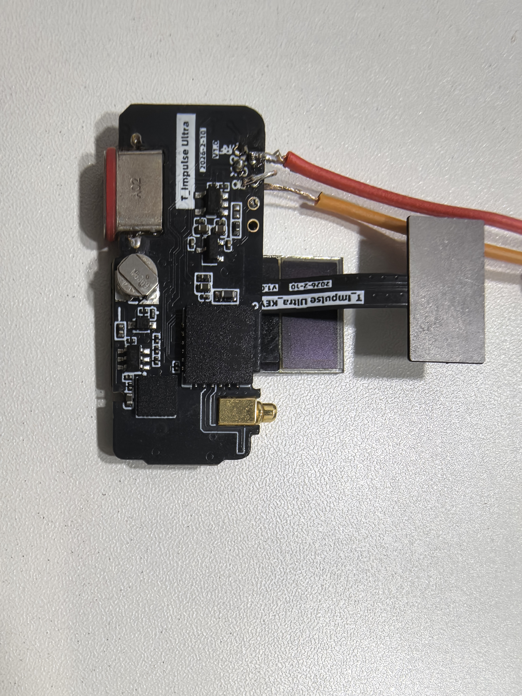

<!--
 * @Description: T-Impulse-Plus V2 硬件调试说明
 * @Author: LILYGO_L
 * @Date: 2025-10-11 13:45:15
 * @LastEditTime: 2026-09-14
 * @License: GPL 3.0
-->

<h1 align="center">T-Impulse-Plus V2.0</h1>

## [English](./README.md) | 中文

## 当前基线

本仓库当前对应 T-Impulse-Plus V2 硬件调试基线。MCU 仍然是
nRF52840，但 V2 的引脚、外设占用关系、上电顺序以及 LoRa/I2C 资源切换
规则都不同于原始 V1 例程。

v2_bringup 是已经测试过的 V2 初始化顺序参考程序。其余 v2_* 例程是单点
调试程序，只初始化正在测试的硬件。串口日志正常不能替代电源轨、电池电压、
射频输出和 GNSS 电源的外部仪器测量。

| 基线 | 状态 | 范围 |
| --- | --- | --- |
| V2 硬件调试例程 | 当前使用 | 15 个单点或综合 PlatformIO 环境 |

## 产品信息

| 产品 | MCU | Flash | RAM | 购买链接 |
| --- | --- | --- | --- | --- |
| T-Impulse-Plus V2| nRF52840 | 1 MB | 256 KB | 暂无 |

## 目录

- [概述](#概述)
- [硬件模块](#硬件模块)
- [V2 硬件引脚](#v2-硬件引脚)
- [LoRa 参数](#lora-参数)
- [参考初始化顺序](#参考初始化顺序)
- [V2 例程](#v2-例程)
- [环境安装与烧录](#环境安装与烧录)
- [推荐验证顺序](#推荐验证顺序)
- [旧版文件与工程资料](#旧版文件与工程资料)
- [常见问题](#常见问题)

## 概述

T-Impulse-Plus V2 是一款基于 nRF52840 的低功耗手环，板载 OLED 屏幕、
SX1262 LoRa 射频模块、MIA-M10Q GNSS 模块、ICM20948 惯性传感器、
QSPI Flash、TTP223 触摸输入、SGM41562 电源管理芯片，以及由 RT9080
控制的 3.3 V 电源轨。

当前 V2 例程统一使用 115200 波特率和英文串口日志。v2_bringup 为了兼容
原有综合测试流程保留了必要的 original_test 命名，但实际使用的是 V2
硬件定义和 V2 资源占用规则。

## 预览

    

## 硬件模块

### MCU

- 芯片：nRF52840
- RAM：256 KB
- Flash：1 MB
- [nRF52840 数据手册](https://docs.nordicsemi.com/bundle/ps_nrf52840/page/keyfeatures_html5.html)

### 屏幕

- 类型：SSD1315 兼容 OLED
- 分辨率：64 x 32
- 总线：屏幕 I2C，使用 Wire1
- 地址：0x3C
- 引脚：SDA=P1.06，SCL=P1.04
- 依赖库：Adafruit_GFX、Adafruit_SSD1306
- [SSD1315 资料](./information/SSD1315.pdf)

### LoRa

- 模组：S62F
- 收发芯片：SX1262
- 总线：SPI，使用 NRF_SPIM3
- 依赖库：RadioLib、Adafruit_BusIO、Adafruit_SPIFlash
- [S62F 资料](./information/S62F.pdf)
- [S62F 应用说明](./information/S62F_ApplicationNote_Ver_D.pdf)

S62F 使用 AcSiP 射频开关控制模式 A。RF_VC1 和 RF_VC2 是 MCU 直接控制
的信号，DIO2 是 SX1262 的独立信号，不能替代射频开关控制脚。V2 射频开关
状态为：接收时 RF_VC1/RF_VC2=LOW/HIGH，发射时为 HIGH/LOW。

当前例程使用 3.0 V TCXO 设置和 SX1262 DC-DC 稳压模式。两端 LoRa 测试
必须使用相同设置。

### GNSS

- 模块：MIA-M10Q
- 总线：UART，38400 8N1
- 模块 TX 网络：P0.02
- 模块 RX 网络：P1.15
- GNSS 电源控制：GPS_EN=P0.24
- [MIA-M10Q 资料](./information/MIA-M10Q-00B.pdf)

当前例程中 GPS_EN 为低电平有效：HIGH 表示关闭 GNSS 电源控制，UART
例程在接收数据前将其拉 LOW。GPS_1PPS 只是 P0.24 的历史兼容别名，
V2 当前没有在这个网络上定义独立 PPS 输入。

### IMU

- 芯片：ICM20948
- 总线：主 I2C
- 地址：0x69
- 引脚：SDA=P1.08，SCL=P0.11
- 中断：P0.07
- [ICM20948 资料](./information/ICM20948.pdf)

### QSPI Flash

- 兼容 JEDEC ID：ZD25WQ32C（BA 60 16）和 ZD25Q32D（BA 40 16）
- 总线：QSPI
- CS=P0.12，SCLK=P0.04，IO0=P0.06，IO1=P1.09，IO2=P0.08，IO3=P0.26
- 依赖库：Adafruit_SPIFlash
- 请通过 v2_flash_test 记录实际 JEDEC ID 和容量；仓库中没有独立的
  Flash PDF 资料。

### 触摸输入

- 芯片：TTP223
- Q 输出：P0.15
- V2 单点例程将其作为输入并进行软件消抖。在整板独立确认前，保持按键
  确认宏为关闭状态。
- [TTP223 资料](./information/TTP223-BA6-TD.pdf)

### 电源与电池

- 充电/电源管理芯片：SGM41562
- SGM41562 地址：0x03
- SGM41562 主 I2C：SDA=P1.08，SCL=P0.11
- SGM41562 中断：P0.16
- 3.3 V 电源轨使能：RT9080_EN=P0.19
- 电池分压开关控制：P0.17
- 电池 ADC：P0.05
- [SGM41562 资料](./information/SGMICRO-SGM41562XGTR.pdf)

## V2 硬件引脚

软件引脚定义以
[libraries/private_library/pin_config.h](./libraries/private_library/pin_config.h)
为准，原理图见
[project/T-Impulse%20Plus.pdf](./project/T-Impulse%20Plus.pdf)。

| 功能 | V2 引脚或设置 | 说明 |
| --- | --- | --- |
| 屏幕 I2C | SDA=P1.06，SCL=P1.04 | Wire1，地址 0x3C，128 x 64 |
| 主 I2C | SDA=P1.08，SCL=P0.11 | SCL 与 SX1262 DIO1 共用 |
| SX1262 CS | P0.29 | |
| SX1262 复位 | P0.03 | |
| SX1262 SCLK | P1.14 | NRF_SPIM3 |
| SX1262 MOSI | P0.28 | |
| SX1262 MISO | P0.30 | |
| SX1262 BUSY | P1.12 | |
| SX1262 DIO1 | P0.11 | 与主 I2C SCL 为同一物理网络 |
| SX1262 DIO2 | P0.31 | |
| SX1262 RF_VC1 | P1.13 | 射频开关控制 |
| SX1262 RF_VC2 | P1.10 | 射频开关控制 |
| Flash CS | P0.12 | QSPI |
| Flash SCLK | P0.04 | QSPI |
| Flash IO0 | P0.06 | QSPI |
| Flash IO1 | P1.09 | QSPI |
| Flash IO2 | P0.08 | QSPI |
| Flash IO3 | P0.26 | QSPI |
| GNSS 模块 TX 网络 | P0.02 | Serial2 的模块 TX 侧 |
| GNSS 模块 RX 网络 | P1.15 | Serial2 的模块 RX 侧 |
| GPS_EN | P0.24 | GPS_1PPS 只是历史兼容别名 |
| ICM20948 中断 | P0.07 | |
| SGM41562 中断 | P0.16 | |
| TTP223 Q | P0.15 | |
| 振动马达 | P0.22 | 高电平脉冲输出 |
| RT9080 使能 | P0.19 | |
| 电池控制 / ADC | P0.17 / P0.05 | P0.17 控制分压开关 |

### 共线限制

P0.11 在物理上同时连接主 I2C SCL 和 SX1262 DIO1。在当前板子上，主 I2C
与 LoRa 不能安全并行运行。LoRa 单点例程必须先调用 Wire.end()，释放
P1.08 和 P0.11，再启动射频 SPI。退出射频窗口时，应先释放射频回调、
SPI 外设和射频引脚，再恢复主 I2C。

## LoRa 参数

发射端和接收端必须使用完全相同的参数：

| 参数 | V2 设置 |
| --- | --- |
| 频率 | 868.0 MHz |
| 带宽 | 125 kHz |
| 扩频因子 | SF10 |
| 编码率 | 4/6 |
| 同步字 | 0xAB |
| 发射功率 | 22 dBm |
| 前导码 | 15 symbols |
| CRC | 关闭 |
| TCXO | 3.0 V |
| 稳压器 | DC-DC |

## V2 例程

每个当前例程目录都包含 README.md，记录串口操作、正常现象和故障判断。

| 例程 | 用途 |
| --- | --- |
| [v2_battery_test](./examples/v2_battery_test) | 对 P0.17 LOW/HIGH 两种状态分别采集 16 次电池分压 ADC |
| [v2_ble_test](./examples/v2_ble_test) | nRF52840 内置 BLE Nordic UART Service 测试 |
| [v2_bringup](./examples/v2_bringup) | 已测试的 V2 综合启动顺序和整板诊断参考 |
| [v2_flash_test](./examples/v2_flash_test) | 只读 QSPI Flash JEDEC ID 和容量测试 |
| [v2_gnss_pps_test](./examples/v2_gnss_pps_test) | GPS_EN/P0.24 控制网络测试，不测独立 PPS |
| [v2_gnss_uart_test](./examples/v2_gnss_uart_test) | 38400 波特率 GNSS UART 和 TinyGPSPlus NMEA 测试 |
| [v2_icm20948_test](./examples/v2_icm20948_test) | ICM20948 加速度计、陀螺仪和磁力计测试 |
| [v2_lora_receive](./examples/v2_lora_receive) | 固定参数的独立 SX1262 接收例程 |
| [v2_lora_transmit](./examples/v2_lora_transmit) | 固定参数的独立 SX1262 发射例程，每 5 秒发送一次 |
| [v2_main_i2c_test](./examples/v2_main_i2c_test) | 主 I2C 线路状态、地址扫描和错误统计 |
| [v2_motor_test](./examples/v2_motor_test) | 50 ms、100 ms、150 ms 有界马达脉冲测试 |
| [v2_original_test](./examples/v2_original_test) | V1 兼容的综合菜单和 V2 外设回归测试 |
| [v2_screen_test](./examples/v2_screen_test) | 屏幕 I2C 线路、地址和 128 x 64 显示测试 |
| [v2_sgm41562_test](./examples/v2_sgm41562_test) | SGM41562 设备 ID、配置、故障和状态测试 |
| [v2_ttp223_test](./examples/v2_ttp223_test) | TTP223 P0.15 基线和消抖输入测试 |

v2_original_test 中的 LoRa 窗口只接收，不发射。要验证两个设备之间的
射频链路，应在另一块板上使用 v2_lora_transmit，并在本板使用
v2_lora_receive 或 v2_lora_test。

## 环境安装与烧录

### PlatformIO

仓库包含 LilyGo T-Impulse Plus nRF52840 自定义开发板定义，并为每个 V2
例程注册了独立 PlatformIO 环境。建议显式指定环境名，使选中的例程映射
到对应的 examples/<name> 目录：

    pio run -e v2_bringup
    pio run -e v2_bringup -t upload
    pio device monitor -e v2_bringup -b 115200

将 v2_bringup 替换为上表中的任意例程名。tools/platformio_select_example.py
负责映射选中的环境，避免默认源目录错误覆盖当前例程。

安装 Visual Studio Code 和 PlatformIO IDE 扩展，将本仓库作为项目目录打开，
并选择 LilyGo T-Impulse Plus nRF52840 开发板。如果本地开发板或框架环境
需要修复，可运行：

    python "tool/win10 vscode platformio start/t_impulse_plus_setup.py"

仓库还提供只检查源码和配置的 V2 静态契约检查：

    powershell -NoProfile -ExecutionPolicy Bypass -File .\tools\tests\verify_v2_hardware_config.ps1

### Arduino IDE

1. 安装 Arduino IDE 和 Adafruit nRF52 开发板包。
2. 运行 tool/win10 arduino ide start/t_impulse_plus_arduino_setup.py，安装
   T-Impulse-Plus board variant 以及所需的编译器库链接参数。
3. 打开选定 examples/v2_* 目录中的 .ino 文件。
4. 选择 LilyGo T-Impulse Plus nRF52840 和正确的 USB 端口。
5. 使用 115200 波特率的串口监视器。
6. 进入 bootloader 下载模式：按下并松开 RST，等待 1 秒，再按下并松开
   RST。电脑出现新的 USB 磁盘后即表示已进入 bootloader 模式。

### J-Link

J-Link/SWD 接线图见 [image/12.jpg](./image/12.jpg)。只有在确实需要预编译
镜像时，才使用 nRF Connect for Desktop Programmer 写入 bootloader 和
firmware。V2 调试例程通常通过 PlatformIO 或 Arduino IDE 编译和烧录。

## 推荐验证顺序

1. 先运行 v2_bringup，确认已经测试过的综合启动标记。
2. 运行 v2_power_test，并用万用表测量 VDD3V3。
3. 运行 v2_screen_test，确认 0x3C 和屏幕显示。
4. 运行 v2_flash_test，记录 JEDEC ID 和容量。
5. 运行 v2_main_i2c_test、v2_sgm41562_test 和 v2_icm20948_test。
6. 运行 v2_battery_test，并用万用表比较计算出的电池电压。
7. 分别运行 v2_motor_test 和 v2_ttp223_test。
8. 运行 v2_gnss_uart_test，再运行 v2_gnss_pps_test 检查 GPS_EN 控制电平。
9. 运行 v2_ble_test。
10. 运行 v2_lora_receive 或 v2_lora_test，再在另一块板上运行
    v2_lora_transmit，并保持参数一致。
11. 运行 v2_original_test，验证综合菜单和资源切换回归。

### LoRa 发射与接收

在一块板上烧录 v2_lora_receive，在另一块板上烧录
v2_lora_transmit，先启动接收端。两块板必须使用 LoRa 参数表中的完全
相同设置。发射端每 5 秒发送一条 ASCII 测试消息，由于 DIO1 位于共用
的 P0.11 网络，发射完成通过 SPI 读取 TX_DONE。接收端输出事件来源、
数据、RSSI、SNR 和频偏。

测试时使用天线、合适的 50 ohm 负载或射频测试夹具，禁止将发射端输出
直接连接到接收端输入。同一块板上不要让主 I2C 例程与独立 LoRa 例程并行
运行。

## 常见问题

### 为什么没有串口输出？

请打开串口助手软件中的“DTR”选项
以 115200 打开串口监视器，并在复位或重新连接 USB 前先打开监视器。检查
USB CDC、VBUS、MCU 电源、复位和选中的 PlatformIO 环境。单点例程的 USB
等待是有限的，监视器打开过晚仍可能错过最初几行日志。

### 为什么直接用 USB 烧录失败？

按下并松开 RST，等待 1 秒，再按下并松开 RST。电脑出现新的 USB 磁盘后，
选择正确端口并重新上传。

## 电池寿命预估
已知设备的平均电流消耗和电池的容量，计算电池寿命。以下是不同能量容量电池的电池寿命计算实例:

例1：
设备的平均电流消耗 :20uA
电池容量:220mAh (标准CR2032纽扣电池 )
电池寿命:0.22Ah/0.00002A=11000hours=458days
